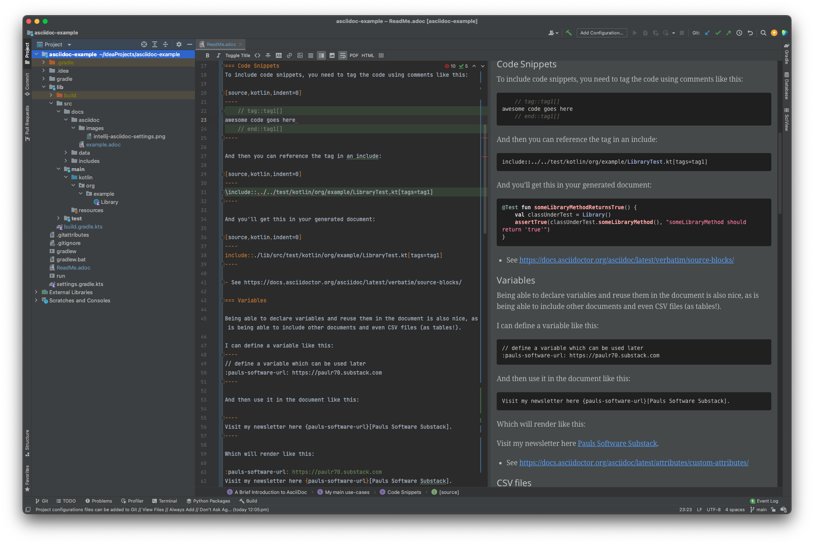

= A Brief Introduction to AsciiDoc
Paul Rule
:url-repo: https://github.com/prule/asciidoc-example
:source-highlighter: rouge
:toc:
:toclevels: 3

[sidebar]
The source code for this document is available at {url-repo}[github].
Unfortunately though, GitHub does NOT support includes so you won't see this document rendered properly. Instead, I've used the Intellij plugin to generate a PDF document which you can see here: link:ReadMe.pdf[ReadMe.pdf].

== Introduction
Asciidoc is a text document format similar to markdown but with extra features and a more standardized syntax. It can output to different formats like html, pdf, docx, epub, etc.

Like markdown, it's a plain text format, so it is easy to read and edit.

I find it particularly attractive for documenting code because you can include code snippets and have them automatically formatted - by including tags in your source code, you can reference them in your asciidoc file. There are a couple of other ways to do this, but I like tags in the source code since you'll know when you are editing this that the code is being used in documentation.

== My main use-cases

=== Code Snippets
To include code snippets, you need to tag the code using comments like this:

[source,kotlin,indent=0]
----
    // tag::tag1[]
awesome code goes here
    // end::tag1[]
----

And then you can reference the tag in an include:

[source,kotlin,indent=0]
----
\include::../../test/kotlin/org/example/LibraryTest.kt[tags=tag1]
----

And you'll get this in your generated document:

[source,kotlin,indent=0]
----
include::./lib/src/test/kotlin/org/example/LibraryTest.kt[tags=tag1]
----

- See https://docs.asciidoctor.org/asciidoc/latest/verbatim/source-blocks/

=== Variables

Being able to declare variables and reuse them in the document is also nice, as is being able to include other documents and even CSV files (as tables!).

I can define a variable like this:
----
// define a variable which can be used later
:pauls-software-url: https://paulr70.substack.com
----

And then use it in the document like this:

----
Visit my newsletter here {pauls-software-url}[Pauls Software Substack].
----

Which will render like this:

:pauls-software-url: https://paulr70.substack.com
Visit my newsletter here {pauls-software-url}[Pauls Software Substack].

- See https://docs.asciidoctor.org/asciidoc/latest/attributes/custom-attributes/

=== CSV files

You can also include CSV files as tables:

----
.Sample CSV
[source,csv]
,===
\include::./lib/src/docs/data/simple.csv[]
,===
----

Which will render like this:

.Sample CSV
[source,csv]
,===
include::./lib/src/docs/data/simple.csv[]
,===

- See https://docs.asciidoctor.org/asciidoc/latest/tables/data-format/

=== Including other documents

You can also include other asciidoc files using the `include` directive:

----
\include::lib/src/docs/includes/references.adoc[]
----

- See https://docs.asciidoctor.org/asciidoc/latest/directives/include/

=== Table of contents

Create an automatic table of contents with the `toc` attribute:

----
:toc:
:toclevels: 3
----

== Intellij Plugin

Intellij has a plugin for Asciidoc.
It supports previewing the document in a preview pane, and you can click on the tag to jump to it.
If the link doesn't resolve, you'll see the error highlighted in the editor.

- See https://intellij-asciidoc-plugin.ahus1.de

== Gradle

Gradle is supported, so with the right plugins configured you can generate HTML, PDF, EPUB from your asciidoc files with some simple gradle configuration like this:

[source,kotlin,indent=0]
----
include::./lib/build.gradle.kts[tags=asciidoctor-gradle-configuration]
----

The `asciidocAttributes` map is used to pass variables to the asciidoc processor so you can use them in your document.

If you want these variables to also work in the Intellij preview pane you'll need to configure them in the Intellij plugin settings:

image:./lib/src/docs/asciidoc/images/intellij-asciidoc-settings.png[Intellij plugin settings - showing source attribute definition]

In this example I've used defaults for everything - so my directory structure for the source looks like this:

----
└── src
    ├── docs
    │   ├── asciidoc
    │   │   ├── example.adoc
    │   │   └── images
    │   │       └── intellij-asciidoc-settings.png
    │   ├── data
    │   │   └── simple.csv
    │   └── includes
    │       └── references.adoc
----

Here, example.adoc is the main document, and references.adoc is included in example.adoc.

I can run gradle tasks to produce HTML or PDF like this (note that my documentation is in the `lib` sub project):

----
./gradlew lib:asciidoc
./gradlew lib:asciidocPdf
----

This produces output in the build folder:

----
├── build
│   ├── docs
│   │   ├── asciidoc
│   │   │   ├── example.html
│   │   │   └── images
│   │   │       └── intellij-asciidoc-settings.png
│   │   └── asciidocPdf
│   │       └── example.pdf
----

== Conclusion

Have fun documenting your code! There's much more to Asciidoc than what I've covered here, but this is a good starting point.

GitHub will (somewhat) render asciidoc files, so you can see the output of this file here: {url-repo} - unfortunately github doesn't support includes, something which is mentioned here https://github.com/github/markup/issues/1095

There is a copy of the gradle generated output in `lib/example-output` if you want to see what it looks like.

include::lib/src/docs/includes/references.adoc[]