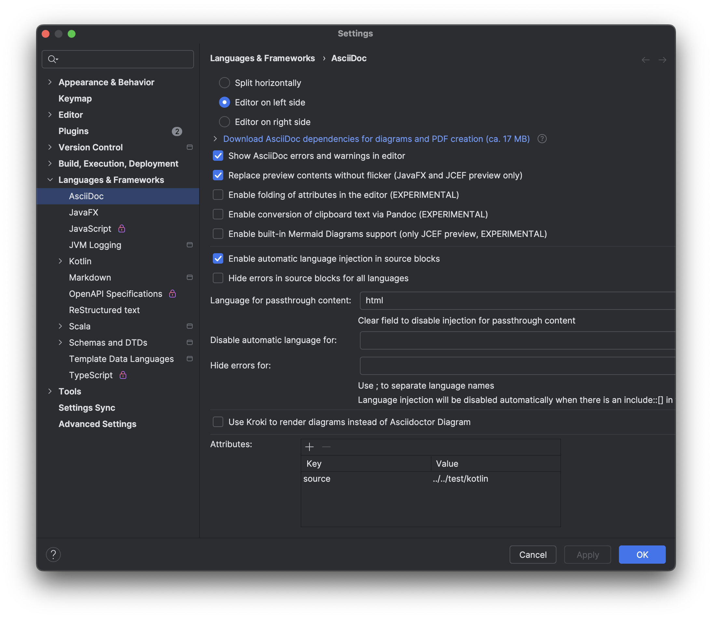

:source-highlighter: rouge

:toc:
:toclevels: 3

This is an example asciidoc file.
It demonstrates basic features of the asciidoc format.


// commenting is possible

---

From https://opensource.com/article/22/8/drop-markdown-asciidoc

== Heading 2

=== Heading 3

==== Heading 4

===== Heading 5

====== Heading 6

[source,python]
----
print('a whole code block')
----

*Bold*

_Italics_

*_Bold and italic_*

`Monospace or code`

---

From https://docs.asciidoctor.org/asciidoctor/latest/get-started/

=== The Dangers of Wolpertingers
// define a variable which can be used later
:url-wolpertinger: https://en.wikipedia.org/wiki/Wolpertinger

// use the variable here
Wolpertingers are {url-wolpertinger}[ravenous beasts].

---

From https://docs.asciidoctor.org/asciidoc/latest/lists/unordered/

.Possible DefOps manual locations
* West wood maze
** Maze heart
*** Reflection pool
** Secret exit
* Untracked file in git repository

---

From https://docs.asciidoctor.org/asciidoc/latest/blocks/sidebars/

[sidebar]
Sidebars are used to visually separate auxiliary bits of content
that supplement the main text.

---

From https://docs.asciidoctor.org/asciidoc/latest/blocks/sidebars/

.Optional Title
****
Sidebars are used to visually separate auxiliary bits of content
that supplement the main text.

TIP: They can contain any type of content.

.Source code block in a sidebar
[source,js]
----
const { expect, expectCalledWith, heredoc } = require('../test/test-utils')
----
****

---

=== Including code snippets

This is awesome - we can insert snippets of code from files. There are several ways to do this, but here I'm showing how to do it by using tags in the source code.

You can tag the source code like this:
```
    // tag::tag1[]
<awesome code goes here>
    // end::tag1[]
```

And then you can reference the tag in an include:

```
[source,kotlin,indent=0]
----
\include::../../test/kotlin/org/example/LibraryTest.kt[tags=tag1]
----
```

And you'll get this:

// works with intellij and gradle with
//         baseDirFollowsSourceDir()
[source,kotlin,indent=0]
----
include::../../test/kotlin/org/example/LibraryTest.kt[tags=tag1]
----

Or, using the source attribute (specified in gradle and in intellij plugin settings):

This
```
[source,kotlin,indent=0]
----
\include::{source}/org/example/LibraryTest.kt[tags=tag1]
----
```

Will produce:

[source,kotlin,indent=0]
----
include::{source}/org/example/LibraryTest.kt[tags=tag1]
----

The intellij plugin will show you the result in a preview pane, and you can click on the tag to jump to it. If the link doesn't resolve, you'll see the error highlighted in the editor.

// https://docs.asciidoctor.org/asciidoc/latest/macros/images/


[source,kotlin,indent=0]
----
include::../../../build.gradle.kts[tags=asciidoctor-gradle-configuration]
----


See:

- https://docs.asciidoctor.org/asciidoc/latest/directives/include/
- https://docs.asciidoctor.org/asciidoc/latest/directives/include-tagged-regions/
- https://docs.asciidoctor.org/asciidoc/latest/directives/include-with-indent/

- https://github.com/asciidoctor/asciidoctor-intellij-plugin

=== More information

- https://matthewsetter.com/asciidoc-plugin-for-intellij-review/

Include a csv file:

.Sample CSV
[source,csv]
,===
include::../data/simple.csv[]
,===